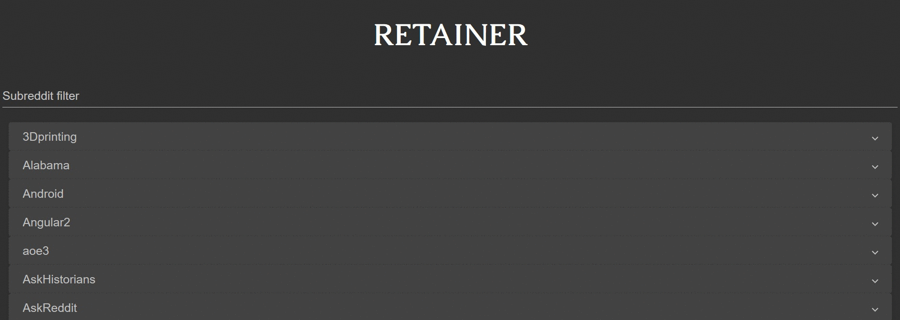

# Table of Contents
* [Overview](#overview)
* [Reddit Configuration](#reddit-configuration)
* [Development](#development)
    * [Getting Started](#getting-started)
    * [Development Server](#development-server)
    * [Running Unit Tests](#running-unit-tests)

# Overview
Retainer is a Reddit client used for viewing your saved Reddit posts. It enables you to view and filter them by subreddit.



# Reddit Configuration
To run locally, you will need to create a [reddit app](https://www.reddit.com/prefs/apps). The `redirect uri` needs to be set to `http://localhost:4200/saved-posts`.

# Development

## Getting started
Retainer uses [Angular](https://angular.io), [Angular CLI](https://cli.angular.io), and [Angular Material](https://material.angular.io/).

Ensure that you have [node.js](https://nodejs.org/en/download/) installed and then run `npm install` to download the necessary npm packages. You will also need to set up a development environment in `src/environment/environment.dev.ts`. In this file you will add configuration from the reddit app you created above. An example file looks like this:

```
{
    export const environment = {
    production: false,
    applicationID: "your reddit app id",
    secret: "your reddit app secret",
    redirectUrl: "http://localhost:4200/"
  };
}
```

## Development server
Run `ng serve -c dev` for a dev server. Navigate to `http://localhost:4200/`. The app will automatically reload if you change any of the source files.

## Running unit tests

Run `ng test` to execute the unit tests via [Karma](https://karma-runner.github.io).
